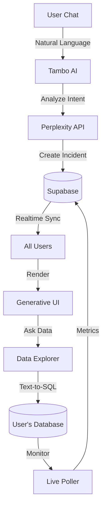

# 🚨 Data Guard: The AI Incident Commander

> **"When production is burning, don't search for dashboards. Data Guard builds them for you, in real-time."**

[](https://youtu.be/YOUR_ID)  
**Live Demo:** [dataguard.vercel.app](https://dataguard.vercel.app)

---

## 🏆 Tambo Hackathon 2026: "The UI Strikes Back"

**Data Guard** is the world's first incident management system with **Generative UI**. Instead of static dashboards, the interface adapts in real-time based on what's breaking.

**Built with:**

- 🤖 Tambo AI (natural language incident detection)
- ⚡ Supabase Realtime (multiplayer sync)
- 🎨 Generative UI (dynamic component rendering)
- 🩺 The Query Doctor (Autonomous DBA)
- 📊 Data Explorer (Text-to-SQL + Viz)

---

## 🎯 What Makes Data Guard Different?

| Traditional Tools           | Data Guard                            |
| --------------------------- | ------------------------------------- |
| Static dashboards           | **Generative UI** adapts per incident |
| English-only                | **Multi-language** (Hindi/Hinglish)   |
| 30-day setup (agents, SDKs) | **30-second** connection              |
| Manual triage               | **AI auto-detects** and categorizes   |
| "Run SQL" manually          | **Autonomous DBA** & Data Explorer    |

**TL;DR:** Not another monitoring tool. An AI-powered incident commander that adapts to YOU.

---

## 🌟 Key Features

### 1. ⚡ Zero-Config Database Monitoring

**No agents. No sidecars. Just credentials.**

```
1. Paste Supabase URL + API Key
2. AI scans your schema
3. Select tables to monitor
4. Start monitoring (< 30 seconds)
```

**What it monitors:**
Failed transactions, Error logs, Slow queries (>1s), Data anomalies.

### 2. 🧠 AI-Powered Incident Detection

**Multi-language natural language processing:**

```
English: "Payment API is failing"
Hindi: "Payment service band ho gayi"
Hinglish: "Yaar checkout phat gayi hai"
```

**What happens:**

1. Tambo AI analyzes intent
2. Perplexity categorizes incident type (e.g., Database, API, Traffic)
3. Creates incident in database & **Generates custom UI**

### 3. 🎨 Generative UI (The Magic!)

**Different problems = Different dashboards**

| Incident Type   | Generated Widgets                             |
| --------------- | --------------------------------------------- |
| Payment Failure | ErrorGraph + PaymentLogs + RollbackButton     |
| Slow Queries    | LatencyGraph + QueryAnalyzer + OptimizeButton |
| Traffic Spike   | TrafficGraph + AutoScaler + LoadBalancer      |

**Powered by `ui_config` JSONB:** The dashboard layout is generated by AI on the fly.

### 4. 🩺 The Query Doctor (Autonomous DBA)

**"Database is slow" is not an insight.**

- **Detects:** Queries running > 1s.
- **Analyzes:** AI explains _why_ it's slow (e.g., "Full Table Scan on `orders`").
- **Fixes:** One-click `CREATE INDEX` execution via `applySocket`.

### 5. 📊 Data Explorer (Generative UI)

A **ChatGPT-like interface** for your database.

> "Show me failed orders from last week grouped by error type"

**Result:** Generates the SQL, executes it securely, and renders a **Bar Chart** or **Area Graph** automatically.

### 6. 🔄 Real-Time Collaboration & Slack

**Multiplayer incident response:**

- All team members see the same dashboard (Supabase Realtime).
- Actions sync across sessions.
- **Slack Integration:** Receive alerts and updates in your channels.

---

## 🏗️ Architecture



**Stack:** Next.js 16, Supabase, Perplexity, Recharts, Framer Motion.

---

## 🚀 Quick Start

### Prerequisites

- Node.js 18+
- [Supabase](https://supabase.com) project

### 1. Clone & Install

```bash
git clone https://github.com/tosif121/data-guard.git
cd data-guard
npm install
```

### 2. Setup Database

1. Go to Supabase SQL Editor
2. Run `supabase/migrations/schema.sql`
3. Enable Realtime for: `services`, `incidents`, `metrics`, `error_logs`

### 3. Configure Environment

```env
# .env.local
NEXT_PUBLIC_SUPABASE_URL=your_project_url
NEXT_PUBLIC_SUPABASE_ANON_KEY=your_anon_key
NEXT_PUBLIC_TAMBO_API_KEY=your_tambo_key
PERPLEXITY_API_KEY=your_perplexity_key
SLACK_WEBHOOK_URL=your_slack_webhook
```

---

## � Demo Scenarios

### 1. The Red Alert (API Failure)

**Context:** Payment API outage.

> "The Payment API is throwing 500 errors everywhere!"
> **Result:** Status turns **CRITICAL**. Shows `ErrorGraph` and "Rollback" button.

### 2. The Desi Developer (Hinglish)

**Context:** Multilingual AI understanding.

> "Yaar pura database phat gaya hai, queries atak rahi hain"
> **Result:** AI detects "Database Latency". Query Doctor suggests an index.

### 3. The Data Story (Analysis)

**Context:** Post-incident review.

> "Show me the failure rate compared to last hour"
> **Result:** Data Explorer generates a comparative Area Chart.

---

> **"From zero to monitoring in 30 seconds. From incident to resolution in 3 minutes."**
>
> Built with ❤️ by [@tosif121](https://github.com/tosif121) for Tambo Hackathon 2026
